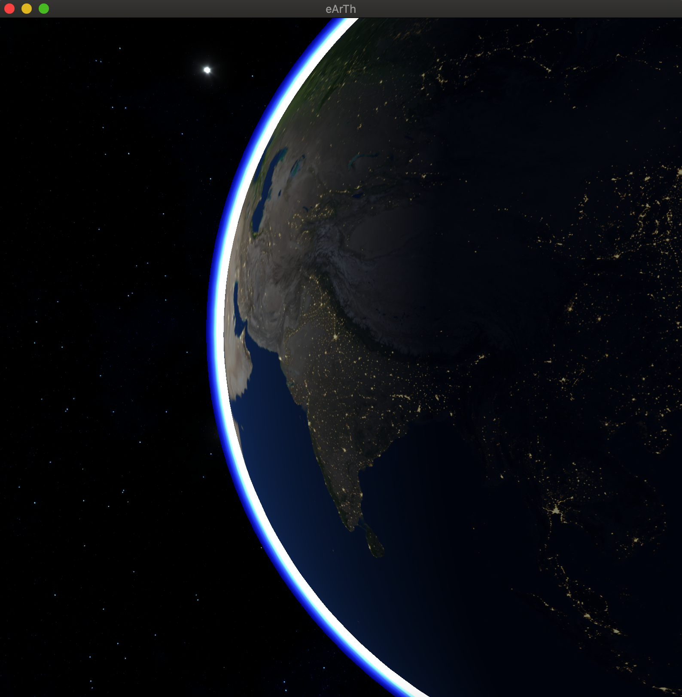
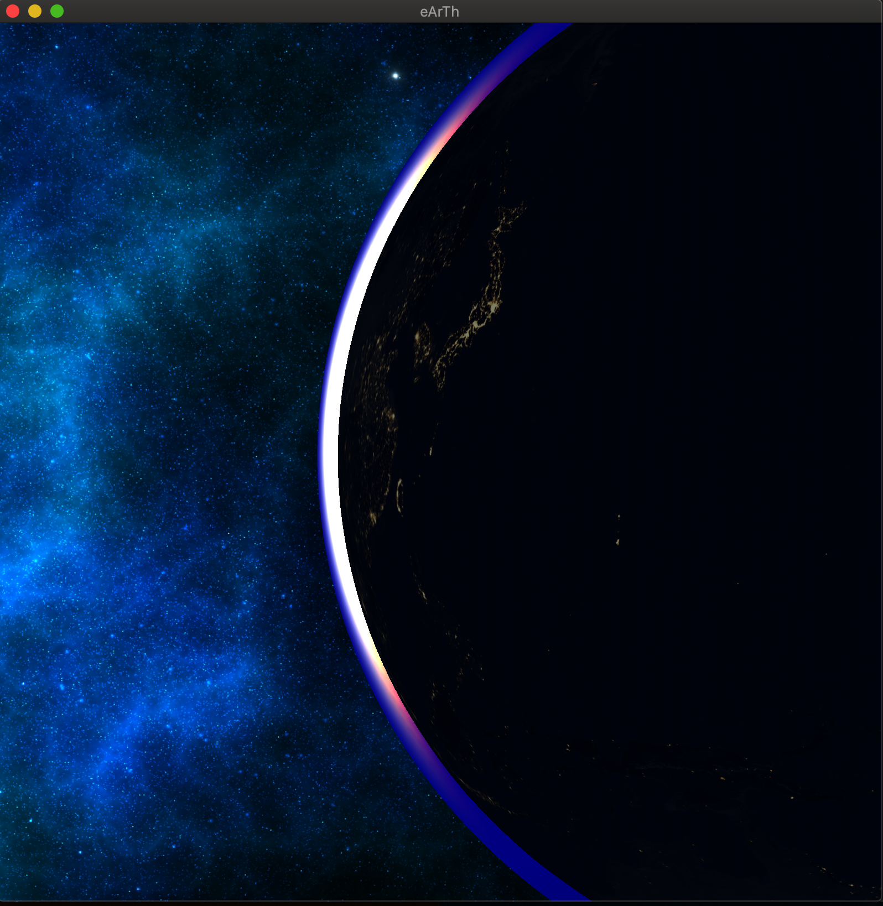

# Planet and Atmosphere Renderer

This is a basic Planet with Atmosphere rendered as a part of Seasons of Code under WnCC, IITB.

Following is the running info - 

- Libraries: **GLFW 3.3** and **GLEW 2.1** 

- Operating System : **OSX**
- shaders folder contains the fragment and vertex shader files for the Planet, Atmosphere and the Skybox.
- utility folder has the following included files -
    - Camera
    - Shader
    - Skybox
    - Sphere
    - stb-image
    - Texture2D
    - readin
- exe file created for Earth is stored in the bin folder

To run the program, use make to compile and then run by executing bin/./Earth in the command line.

A short video has been provided along with the code folder.

Here are two snapshots of the model.

